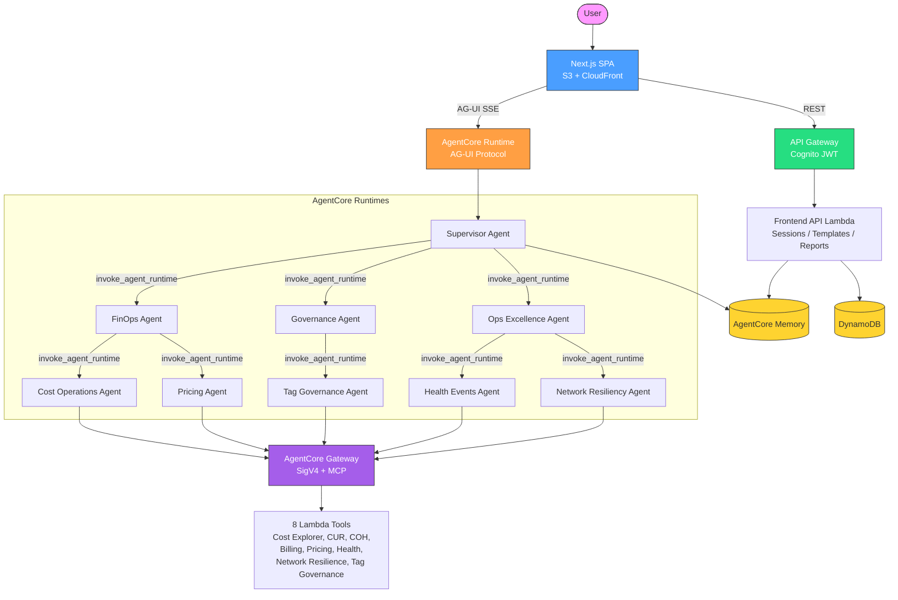

# CloudOps Multi-Agent Platform

> **Important:** This project is intended for educational and demonstration
> purposes only. It is not intended for use in production environments without
> additional hardening. See [Security Hardening for Production](#security-hardening-for-production)
> below and the [AWS Solutions Guidance Disclaimer](https://docs.aws.amazon.com/solutions/guidance-disclaimers/).

A hierarchical multi-agent system for AWS cloud operations, built on
[Amazon Bedrock AgentCore](https://aws.amazon.com/bedrock/agentcore/)
with [Strands Agents SDK](https://github.com/strands-agents/sdk-python)
and an AG-UI streaming Next.js frontend.

Ask it things like *"What were my AWS costs last month?"*, *"Are any
critical AWS Health events open?"*, *"How resilient is my Direct
Connect topology?"* — and get structured answers, interactive
visualisations, and downloadable reports.

<!-- DEMO VIDEO PLACEHOLDER
     Drop a short (60-90s) walkthrough showcasing the chat interface,
     visualizer panel, and report generation. Embed via HTML <video> or
     link out to YouTube/Loom. Suggested: keep the raw file under
     docs/assets/ or host externally. -->

---

## Architecture



Three layers:

- **Supervisor** receives the user request, loads memory, delegates to
  a domain agent.
- **Mid-level agents** (FinOps, Governance, Ops Excellence) route to
  exactly one specialised leaf per request.
- **Leaf agents** call AWS APIs via Lambda tools through the AgentCore
  Gateway.

All agents run on AgentCore Runtime containers. Inter-agent
communication is SigV4-signed HTTP; the supervisor speaks AG-UI to the
browser. All agent behaviour is defined in a single config file —
`src/agents/hierarchy.json` — so adding or changing agents is a JSON
edit, not a code change.

For platform internals (memory, tool tracing, build hashing, gateway
sync), see [docs/architecture.md](docs/architecture.md).

---

## What's included

- **Hierarchical agent orchestration** with memory, follow-up
  suggestions, and structured reports.
- **8 AWS tools** wired through AgentCore Gateway: Cost Explorer, CUR
  (Athena), Cost Optimization Hub, Billing/Anomalies, Pricing, Health
  Events, Network Resilience, Tag Governance.
- **Health events pipeline** with rules-based risk scoring, Claude
  Haiku 4.5 narrative enrichment, and optional Organisation-wide view
  for 1000+ account orgs. See
  [docs/agents/health-events.md](docs/agents/health-events.md).
- **Org-wide tag governance** — read-only tag compliance scanning via
  Resource Explorer, Organizations Tag Policy resolution, remediation
  console deep-links pre-filtered per violation, and cost-allocation
  tag activation health. See
  [docs/agents/tag-governance.md](docs/agents/tag-governance.md).
- **Direct Connect topology visualiser** — React Flow canvas with 19
  node types, resilience scorecard, failure simulation, live BGP
  status.
- **Report generation** with parallel section execution, dependency
  resolution, and PDF/HTML/Markdown/PNG export.
- **Flexible topologies** — any agent in the tree can be promoted to
  the user-facing entry point (single leaf, mid-level hub, or full
  hierarchy).

---

## Deployment topologies

The `type` field in `hierarchy.json` determines which code path an agent
uses. Any agent can be `"type": "frontend"` to become the user-facing
entry point.

**Single leaf agent standalone**

```
hierarchy.json: cost-operations-agent.type = "frontend"
DEPLOY_AGENTS=cost-operations-agent

Frontend → cost-operations-agent (AG-UI) → Gateway MCP tools
```

**Mid-level agent with children**

```
hierarchy.json: finops-agent.type = "frontend"
DEPLOY_AGENTS=finops-agent,cost-operations-agent,pricing-agent

Frontend → finops-agent (AG-UI) → cost-operations-agent (HTTP) → Gateway
                                → pricing-agent (HTTP) → Gateway
```

**Full hierarchy (default)**

```
Frontend → supervisor (AG-UI) → finops-agent (HTTP)      → cost-ops (HTTP)        → Gateway
                                                          → pricing (HTTP)         → Gateway
                              → governance-agent (HTTP)   → tag-governance (HTTP)  → Gateway
                              → ops-excellence (HTTP)     → health-events (HTTP)   → Gateway
                                                          → network-resiliency (HTTP) → Gateway
```

To switch topologies: change the `type` field in `hierarchy.json`, set
`DEPLOY_AGENTS`, redeploy.

---

## Quick start

### Prerequisites

- AWS CLI, Terraform, Finch (or Docker), Node.js, Python 3.12
- AWS credentials configured

### First-time deploy (one command)

```bash
finch vm start      # Start container runtime (needed for agent images)
make quickstart     # Setup → configure → deploy (~15 min first time)
```

### Day-to-day

```bash
make deploy-auto    # Re-deploy changes (1-2 min for prompt edits, ~5 min for code changes)
make run-local      # Local frontend dev server (hot reload, talks to deployed backend)
make plan           # Terraform plan without applying
make destroy        # Tear down infrastructure
make destroy-all    # Nuclear: infra + ECR + memory + state backend
```

---

## Deployment options

### Modes

Set `DEPLOY_MODE` in `.env` to control scope:

| Mode | Agents | Gateway | Tools | Frontend | Cognito | Use case |
|------|:---:|:---:|:---:|:---:|:---:|---|
| `full` (default) | ✅ | ✅ | ✅ | ✅ | ✅ | Production / first deploy |
| `agents-only` | ✅ | ✅ | ✅ | ❌ | ✅ | Backend-only changes |
| `gateway-only` | ❌ | ✅ | ✅ | ❌ | If OAuth | Standalone MCP server for external clients |
| `tools-only` | ❌ | ❌ | ✅ | ❌ | ❌ | Lambda tool iteration |

### Selective deployment

```bash
DEPLOY_AGENTS=finops-agent          # Only this agent + its parent chain
DEPLOY_TOOLS=cost-explorer,billing  # Only these Lambda tools
GATEWAY_AUTH=oauth                  # Add Cognito JWT auth on the gateway
```

One-off overrides:

```bash
DEPLOY_TOOLS=health-events make deploy-auto
```

### Health events — optional org-wide view

The health-events collector ingests AWS Health events (scheduled
maintenance, service issues, AWS investigations) for the deploy
account by default. For multi-account orgs it can aggregate across
all members via AWS Health Organizational View — one central
EventBridge rule, no per-member plumbing.

See [docs/agents/health-events.md](docs/agents/health-events.md) for the four deploy
modes (single-account, org-mgmt, org-delegated, cross-account), the
AWS Support plan matrix (EventBridge is free; backfill needs
Business+ Support), and the `make backfill-health` command.

### Reconfiguring

```bash
make reconfigure-shared    # Re-run the interactive config with a diff + APPLY CHANGES gate
```

---

## Testing

```bash
make test-unit         # 415+ unit tests (moto, pytest) — reports, memory, tracing, prompts,
                       # health-events collector (risk rules + LLM enrichment paths)
make test-integration  # End-to-end against a deployed stack (requires Cognito creds in scripts/.env)
```

Integration tests need `COGNITO_USERNAME` and `COGNITO_PASSWORD` in
`scripts/.env`.

---

## Teardown

```bash
make destroy         # terraform destroy only
make destroy-all     # Full teardown: infra + ECR + memory + state backend + log groups
```

---

## Project structure

```
src/
  agents/                       # Strands agents — config-driven
    hierarchy.json              # Single source of truth (prompts, models, type, children)
    frontend/ orchestrator/ worker/
    shared/                     # memory, tracing, reports, gateway, registry, cross_account
  lambda/
    mcp/                        # One folder per AWS API surface (8 tools)
    frontend/                   # Browser-facing REST Lambdas (JWT-authorised)
    collectors/                 # Background collectors (EventBridge → SQS → Lambda → DDB)
  frontend/                     # Next.js static export SPA + visualiser / reports / tours

terraform/
  modules/core/                 # Platform modules (runtime, gateway, memory, cognito, etc.)
  modules/custom/               # Optional modules (health-events, network-resilience)

scripts/
  deploy.sh + lib/              # Deploy orchestrator + sub-scripts
  backfill_health.py            # Health events backfill (opt-in)
  debug/                        # Log tailer, gateway fixer, CLI invoke, NR health check

docs/
  architecture.md               # Platform internals
skills/
  developer-guide/SKILL.md      # Adding agents / tools / collectors (interactive)
  eks-operation-review/SKILL.md # EKS operational excellence assessment (10 areas, rated report)
  agents/                       # Per-leaf-agent references (deploy modes, data model, gotchas)
    README.md                   # When to add a file + section template
    cost-operations.md          # Cost Explorer / CUR / COH reference
    pricing.md                  # Pricing catalog / anomalies / budgets
    health-events.md            # Health events feature reference
    network-resiliency.md       # Direct Connect topology + resilience rules
    tag-governance.md           # Tag governance feature reference
  observability-tuning.md       # X-Ray + Transaction Search knobs

tests/unit/                     # pytest + moto
```

---

## Makefile targets

```
make setup                Identity setup (.env) + install deps
make configure            First-run shared config (SSM + JSON)
make reconfigure-shared   Change shared config (diff + APPLY CHANGES gate)

make deploy-auto          Deploy everything non-interactively
make deploy               Interactive deployment
make plan                 Terraform plan only
make package              Package Lambda tools (hash-based, parallel)
make build-agents         Build container images only

make backfill-health DAYS=30 [ORG=1] [ROLE_ARN=...]   See docs/agents/health-events.md

make run-local            Frontend with Cognito auth
make run-local-bypass     Frontend without auth (dev only)

make test                 Unit tests
make test-integration     Integration tests (requires deployed stack)

make destroy              terraform destroy
make destroy-all          Full teardown including state backend
make clean                Remove build artifacts

make help                 Show all targets
```

---

## Environment configuration

Two-tier: **per-developer identity** lives in `.env` (`AWS_PROFILE`,
`PROJECT_PREFIX`, `ENVIRONMENT`). **Shared project config** (region,
IdP, cross-account roles, CUR settings, deploy flags) lives in SSM
Parameter Store under `/$PROJECT_PREFIX/$ENVIRONMENT/config/*`,
managed by `terraform/modules/core/shared-config/`.

On every deploy, precedence is (highest wins):

1. CLI env override: `AWS_REGION=eu-west-1 make deploy-auto`
2. `terraform/config.auto.tfvars.json` (written by `make configure`)
3. Terraform variable default

See `.env.example` for the canonical identity-only `.env` template and
`scripts/shared-keys.txt` for the full list of shared keys.

---

## Documentation

- [docs/development.md](docs/development.md) — project conventions, build/deploy
  commands, and high-signal gotchas. Start here when contributing.
- [skills/developer-guide/SKILL.md](skills/developer-guide/SKILL.md) — how to add
  agents, Lambda tools, and data collectors (also invocable as `/developer-guide`).
- [docs/architecture.md](docs/architecture.md) — platform internals:
  memory, tool tracing, build hashing, frontend architecture,
  gateway schema sync.
- [docs/agents/](docs/agents/README.md) — per-leaf-agent reference
  files (deploy modes, data model, gotchas). Add a file here for any
  new leaf with non-trivial deploy or operational surface.
  - [docs/agents/cost-operations.md](docs/agents/cost-operations.md)
    — Cost Explorer / CUR / COH surfaces + cross-account setup.
  - [docs/agents/pricing.md](docs/agents/pricing.md) — AWS Pricing
    catalog, Cost Anomaly Detection, AWS Budgets.
  - [docs/agents/health-events.md](docs/agents/health-events.md) —
    health events deploy modes, AWS Support plan matrix, backfill flow.
  - [docs/agents/network-resiliency.md](docs/agents/network-resiliency.md)
    — Direct Connect topology discovery and 22-rule resilience
    assessment.
  - [docs/agents/tag-governance.md](docs/agents/tag-governance.md) —
    tag governance deploy modes, Resource Explorer multi-account
    setup, tag-policy bring-up commands, read-only-by-design rationale.
- [docs/observability-tuning.md](docs/observability-tuning.md) —
  X-Ray sampling and Transaction Search indexing knobs.

---

## Skills (Claude Code / Kiro)

Skills provide the platform's analytical capabilities as portable workflows that work across any MCP-compatible environment. They auto-detect the best execution path: MCP tools (if gateway is connected) → AWS CLI (if available) → delegate to coding agent.

| Skill | Invoke with | What it does |
|-------|------------|--------------|
| `/developer-guide` | "how do I add an agent?" | Interactive guide for extending the platform |
| `/resilience-report` | "generate a DX resilience report" | Self-contained HTML with topology + assessment |
| `/finops-analysis` | "what are my top costs?" | Cost breakdown, trends, forecasts, savings |
| `/health-events-digest` | "any critical health events?" | Health event digest with risk scoring |
| `/tag-governance-assessment` | "how's my tag compliance?" | Tag compliance scoring + remediation links |
| `/eks-operation-review` | "review my EKS cluster" | EKS operational excellence assessment (10 areas, GREEN/AMBER/RED rated report) |

### How to use skills

Skills are invoked by typing `/skill-name` in Claude Code or Kiro. Each skill auto-detects the best execution path:

| Path | When | What you need |
|------|------|---------------|
| **MCP tools** (fastest) | Gateway is connected to your IDE | `DEPLOY_MODE=gateway-only` deployed + gateway endpoint in MCP config |
| **AWS CLI** | Working locally with credentials | AWS CLI v2 + active credentials (`aws sts get-caller-identity` works) |
| **Delegate** | Sandboxed environment | Coding agent (Kiro) enabled in host capabilities |

### Connecting the MCP gateway to your IDE

For the MCP tool path (recommended — handles cross-account, pre-enriched data):

```bash
# 1. Deploy the gateway + Lambda tools only (no agents, no frontend)
DEPLOY_MODE=gateway-only make deploy-auto

# 2. Get the gateway endpoint
terraform -chdir=terraform output gateway_endpoint

# 3. Add to your IDE's MCP config
#    Claude Code: .mcp.json at project root
#    Kiro: Settings → MCP Servers

```

Once connected, skills detect the tools automatically and skip the CLI/delegate paths.

---

## Security Hardening for Production

This sample includes foundational security controls (SigV4 inter-agent auth, Cognito JWT, IAM least-privilege, tenant isolation, output redaction, Bedrock Guardrails). For production deployments, consider the following additional hardening:

| Area | Recommendation |
|------|----------------|
| **Network isolation** | Place Lambda functions in a VPC with VPC endpoints for DynamoDB, Bedrock, SSM, and STS. Remove public internet paths for data-plane traffic. |
| **Web Application Firewall** | Enable AWS WAF on the CloudFront distribution with managed rule groups (AWSManagedRulesCommonRuleSet, AWSManagedRulesKnownBadInputsRuleSet) and rate-limiting rules. |
| **Container scanning** | Enable ECR scan-on-push and integrate vulnerability findings into the build pipeline. Block deployment of images with Critical/High CVEs. |
| **Threat detection** | Enable Amazon GuardDuty for runtime threat detection on IAM credential abuse, container anomalies, and DNS exfiltration. |
| **Key management** | Rotate KMS customer-managed keys annually. Use separate keys per data classification tier. |
| **Rate limiting** | Add per-user throttling at API Gateway (token bucket) and Bedrock inference quota management. |
| **Audit logging** | Enable CloudTrail Data Events for DynamoDB and S3 to capture item-level access. Retain audit logs for 365 days minimum. |
| **Incident response** | Develop IR playbooks for AI-specific incidents (prompt injection, memory poisoning, model abuse). |

---

## License

This project is licensed under the MIT-0 License. See the [LICENSE](LICENSE) file.
