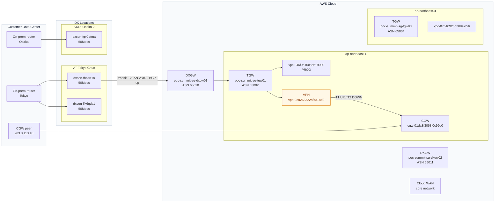

# AWS Direct Connect Resilience Report

You generate a single self-contained HTML file that replicates the visualization and assessment produced by the Network Resilience Agent POC, using **live data** pulled from the user's currently-authenticated AWS account.

## Routing — read first, before anything else

This skill works in three environments. Decide which path you are on **before** you start.

**Path M — MCP tools available (preferred).** The CloudOps platform's `network-resilience` MCP tools are connected (via gateway-only deploy or full platform). Check by looking for these tools in your available tool list:
- `discover_dx_topology`
- `assess_dx_resiliency`
- `get_recommendation_details`
- `estimate_upgrade_cost`

If these tools are available, use them directly — they handle all fetching, assessment, and cross-account access. Skip Phase 1 and Phase 2 entirely. Go straight to Phase 3 (render) using the tool outputs.

**Path A — Direct execution.** You are in any agent environment where you can run shell commands and the AWS CLI is reachable, but the MCP tools above are NOT available. Run the workflow yourself: AWS CLI calls in Phase 1, assessment in Phase 2, HTML render in Phase 3.

**Path B — Delegate to a coding agent.** You are in a sandboxed host where:
- `import boto3` raises ImportError, **and**
- `subprocess.run(['aws', ...])` either fails or the AWS CLI binary is missing, **and**
- The MCP tools above are NOT available, **and**
- A coding agent with shell/AWS access is enabled in the host's capabilities.

In that case, **do not** try to call AWS yourself. Instead, route the task through the host's coding-agent integration. Hand the coding agent the brief in [Appendix: Path B brief](#appendix--path-b-brief-for-coding-agent) and relay only its final summary back to the user.

**Quick decision check:**

```
Are discover_dx_topology / assess_dx_resiliency MCP tools available?
├── Yes → Path M (use MCP tools — fastest, handles cross-account)
└── No
    ├── Can you run `aws --version`?
    │   ├── Yes → Path A (run it yourself via CLI)
    │   └── No
    │       ├── Is a coding agent enabled? → Path B (delegate)
    │       └── No → Stop. Tell the user: "I can't reach AWS or the MCP
    │                    gateway from here. Deploy with DEPLOY_MODE=gateway-only
    │                    and connect the gateway, or run in a shell-capable agent."
```

The phases below describe Path A. Path M skips to Phase 3. Path B's brief is at the end of the file.

## Path M — Using MCP tools

When the network-resilience MCP tools are available, the workflow is:

1. Call `discover_dx_topology` — returns the full topology JSON (connections, VIFs, gateways, VPNs, TGWs, VPCs, routes, CloudWatch utilization, health events)
2. Call `assess_dx_resiliency` — returns per-DXGW scores, rule results, and prioritized recommendations
3. Optionally call `get_recommendation_details` for any specific finding the user wants expanded
4. Optionally call `estimate_upgrade_cost` if the user wants cost-to-target pricing
5. Render the HTML report (Phase 3) using the tool outputs

The MCP tools handle cross-account access automatically (via `CROSS_ACCOUNT_ROLE_ARN_NETWORK_RESILIENCE` configured at deploy time). No IAM troubleshooting needed on this path.

## Bundled reference files

These ship with the skill in the `reference/` folder. **Read them when you need them — do not paraphrase from memory.**

| File | When to load |
|---|---|
| `reference/fetch-checklist.md` | Before Phase 1. Authoritative list of every AWS CLI call, their order, and which rule each call feeds. |
| `reference/rule-legend.md` | While assessing in Phase 2. Source-of-truth for which rules are Detected vs Guidance, and why guidance rules cannot be observed. |
| `reference/iam-policy.json` | Only if the user reports `AccessDenied` errors and asks what permissions to grant. Do not volunteer this — it is a troubleshooting aid. |
| `reference/report-template.html` | At the start of Phase 3. Copy verbatim and substitute the `{{TOKEN}}` placeholders. Do not invent additional sections, restyle the page, or strip the footer.|

## When to use

Activate this skill when the user asks for any of:
- "Resilience report", "DX posture report", "Direct Connect review"
- "Audit my Direct Connect setup"
- "Generate the AWS network resilience HTML"
- "Run the DX resilience check"

## Prerequisites — verify before fetching

Before any AWS calls, confirm all of the following in one shell command per check. **Stop and surface the problem to the user if any check fails — do not fabricate output.**

1. AWS CLI v2 is installed: `aws --version`
2. The user has active credentials: `aws sts get-caller-identity` — note `Account` and `Arn`. If this fails, instruct the user to run `aws sso login` (or set credentials) and re-invoke the skill.
3. A primary region is set. Use `AWS_REGION` if exported, else `aws configure get region`, else ask the user.
4. The caller has at minimum these read permissions (the skill is purely read-only):
   - `directconnect:Describe*`
   - `ec2:Describe*` (for VPC/VGW/TGW/VPN/CGW)
   - `networkmanager:List*` / `networkmanager:Get*`
   - `cloudwatch:GetMetricData`, `cloudwatch:ListMetrics`
   - `health:DescribeEvents` (optional — degrade gracefully if denied)

If a single API returns AccessDenied, log the error in a "Data gaps" section of the report and continue — never abort the whole report on one denied call.

## Hard constraints — do not violate

- **Never fabricate AWS facts.** If you are unsure whether a tier name, SLA percentage, pricing figure, or API field is real, omit it or ask the user. Do not extrapolate. The only SLA tiers you may reference are the three named on the AWS Direct Connect SLA page: Single Connection (95%), Multi-Site Non-Redundant (99.9%), Multi-Site Redundant (99.99%).
- **Read-only.** Do not call any AWS API that mutates state. No `Create*`, `Modify*`, `Delete*`, `Start*`, `Update*`, `Put*`, `Associate*`, `Detach*`.
- **No credential exfiltration.** Do not include access keys, session tokens, or SSO refresh tokens in the HTML output. The account ID is fine.
- **Single HTML file.** All CSS, JS (only what Mermaid needs), and data must be inline. The file must open offline by double-clicking — except for the one `<script src="https://cdn.jsdelivr.net/npm/mermaid@10/dist/mermaid.min.js">` tag.
- **Cite every detected finding to the AWS field that drove it** (e.g. "VIF state = `down`", "`vgwTelemetry[].status` = DOWN on tunnel 2"). Guidance findings should be labeled "Guidance — not detectable from AWS APIs".

## Workflow

### Phase 1 — Topology fetch (parallel where possible)

Follow `reference/fetch-checklist.md` exactly. It lists every read-only AWS CLI call, the order to issue them in, and which rule each call feeds. Run per-region calls in parallel (one batch per region). Pipe everything into one consolidated JSON object held in working memory.

### Phase 2 — Assess

Use `reference/rule-legend.md` as the authoritative list of rules and what each one detects. Read it once before evaluating. Keep `Detected` vs `Guidance` separation visible in the report — do not present guidance items as if they were observed.

**Resiliency tiering** is computed **per attached DX Gateway only** — there is no global tier. Use only the connections/VIFs/locations/LAGs that feed each DXGW (via VIF → Connection → Location):
- `maximum` (99.99% Multi-Site Redundant): ≥2 locations and every location has ≥2 unique `awsLogicalDeviceId`
- `high` (99.9% Multi-Site Non-Redundant): ≥2 locations
- `devtest` (95% Single Connection): exactly 1 location with any device count
- `none`: no connections or VIFs

Do not present a global resiliency tier or numeric score. The report's headline is an executive summary plus per-DXGW tier cards.

**Severity assignment:**
- `critical`: anything that breaks data plane today (`vif-down`, `connection-not-available`, both VPN tunnels down)
- `warning`: anything that breaks SLA targets or removes redundancy (`single-dx-location`, `single-connection-per-location`, `no-vpn-backup`, `cgw-redundancy`, `dx-partner-diversity`, partial VPN tunnel down, `bgp-route-limit` over)
- `info`: everything else, including all guidance rules

**`enterprise-support-required` / `well-architected-review-required`:** include only when the relevant target tier applies (`high` or `maximum` for Enterprise Support, `maximum` for WA Review). They are always Guidance/attestation — never claim they are detected.

### Phase 3 — Render the HTML report

Produce one file: `dx-resilience-report-<ACCOUNT-ID>-<YYYY-MM-DD>.html`. Save it to the user's chosen location (default: their Desktop). Open it in their default browser.

**Start from `reference/report-template.html`.** Copy it verbatim and substitute the `{{TOKEN}}` placeholders with values from your assessment. Do not add new top-level sections, do not restyle the page, do not strip the methodology footer. The token list (must all be filled or replaced with the empty-state fallback noted):

| Token | Source | Empty-state fallback |
|---|---|---|
| `{{ACCOUNT_ID}}` | `sts:GetCallerIdentity` | — |
| `{{ACCOUNT_ALIAS_OPT}}` | `iam:ListAccountAliases` first item, formatted as ` · <alias>` | empty string |
| `{{TIMESTAMP}}` | local time the report runs | — |
| `{{PRIMARY_REGION}}` | the region the user authenticated against | — |
| `{{REGION_LIST}}` | comma-separated discovered regions | "(none discovered)" |
| `{{CRITICAL_COUNT}}` / `{{WARNING_COUNT}}` / `{{INFO_COUNT}}` | finding counts | 0 |
| `{{SUMMARY_LINE}}` | one-line plain-English posture | — |
| `{{EXECUTIVE_SUMMARY}}` | 3–5 short paragraphs in plain HTML (`<p>`/`<ul>`/`<li>`) covering: (1) overall posture in business terms, (2) what's working (redundancy actually in place), (3) the most material gaps with their resilience impact, (4) a short prioritized next-steps list. Reference resource IDs but lead with plain-English meaning, not jargon. | "<p class=\"meta\">No DX presence — nothing to summarize.</p>" |
| `{{MERMAID_BLOCK}}` | the `flowchart LR` block — see "Diagram requirements" below | a single node `NoDX[No Direct Connect resources found]` |
| `{{DXGW_CARDS}}` | one `<div class="card">` per attached DXGW with current resiliency tier label and recommendation list (no score). Skip DXGWs flagged `isUnattached` (no VIFs). | "<p class=\"meta\">No DX Gateways found.</p>" |
| `{{FINDINGS_CRITICAL}}` / `{{FINDINGS_WARNING}}` / `{{FINDINGS_INFO}}` | one `<div class="finding">` per recommendation grouped by severity | "<p class=\"meta\">None.</p>" |
| `{{UTILIZATION_TABLE}}` | top 5 VIFs and connections by peak egress %, with inline SVG sparklines if datapoints exist | "<p class=\"meta\">No CloudWatch datapoints available.</p>" |
| Inventory `{{*_TABLE}}` and `{{*_COUNT}}` | inventory tables | empty `<table>` body and `0` count |
| `{{DATA_GAPS}}` | bulleted list of every API/region/metric error logged during fetch | "<p class=\"meta\">None.</p>" |

**Diagram requirements** (`{{MERMAID_BLOCK}}`):

The diagram must mirror the four-zone, left-to-right swim-lane layout used by the React Flow visualizer (`dx-visualizer/src/engine/layout-engine.ts`). Do **not** make AWS regions top-level subgraphs — they live *inside* the AWS Cloud zone.

- `flowchart LR`, with the `classDef` lines below.
- **Three top-level zones, in this exact left-to-right order, each a `subgraph`:**
  1. `CUST[Customer Data Center]` — on-prem router(s) (one per DX location, plus per-CGW for any S2S VPN). Group by `bgpPeerAddress`/`customerAddress` so two VIFs to the same on-prem device collapse into one node.
  2. `DX[DX Locations]` — one `subgraph DX_LOC_<code>` per `directconnect:Location.locationCode`. Connections sit inside their DX_LOC subgraph. Place the customer-side router in zone 1 with an edge into its DX_LOC.
  3. `AWS[AWS Cloud]` — every AWS-side resource. Inside this zone, nest one `subgraph REGION_<code>` per AWS region (e.g. `REGION_NRT[ap-northeast-1]`). DX Gateways are *global* — render them inside `AWS[AWS Cloud]` but **outside** any region subgraph (DXGWs span regions). Cloud WAN core network is the same: inside AWS, outside any region.
  4. Within each `REGION_*`: TGWs, VGWs, VPCs, VPN connections, CGWs (CGW node also inside region — the on-prem partner of the CGW belongs in zone 1).
- **Customer Data Center stays in the leftmost column.** Do not draw edges *from* AWS-side resources back into `CUST` (e.g. `CGW01 --> CGW01_ONPREM`). Mermaid's LR engine will stretch `CUST` across the whole diagram if any node in zone 3 points back into it. Instead, edges to the on-prem CGW peer must originate **in zone 1**: `CGW01_ONPREM --> CGW01` (or use `---` for an undirected link). Same rule for any other "AWS → on-prem" relationship: flip the edge direction so the source is the CUST zone node.
- **Edge order matches the swim-lane:** `OnPrem ──▶ Connection ──▶ DXGW ──▶ TGW/VGW ──▶ VPC`, plus `CGW_peer ──▶ CGW` for VPN return paths. Don't draw edges that jump zones backwards.
- **Multi-line node labels.** Long node labels (anything over ~25 chars, e.g. `VGW poc-summit-sg-vgw01`, `DXGW poc-summit-sg-dxgw01 · ASN 65010`) must use `<br/>` to wrap. Pattern: `LABEL[Type<br/>name<br/>extra]`. Examples:
  - `DXGW01[DXGW<br/>poc-summit-sg-dxgw01<br/>ASN 65010]`
  - `VGW01[VGW<br/>poc-summit-sg-vgw01]`
  - `CONN_01[dxcon-fhcart1n<br/>50Mbps]`
  - `VPN01[VPN<br/>vpn-0ea263322af7a14d2]`
  - `VPC_PROD[vpc-046f9e10c66619000<br/>PROD]`
  Do **not** use ` · ` separators inside node text; use `<br/>` between every logical field. ` · ` is only for *edge* labels, which stay on one line.
- VIF edges originate at the connection (in zone 2) and terminate at the DXGW (or VGW for private-VIF-without-DXGW) in zone 3.
- DXGW associations terminate at a TGW/VGW inside the relevant `REGION_*` subgraph in zone 3. Cross-region DXGW associations naturally cross region boundaries — that's expected.
- Cross-account VPCs labeled `(acct: <id>)` from `resourceOwnerId` on the TGW attachment that owns them.
- Mark down/unavailable resources with `:::critical`. Best-practice ghost recommendations use `:::recommended` (dashed green).
- VIF edge labels: `<vifType> · VLAN <vlan> · BGP <bgpStatus> · accepted <n> · ↑<egressLabel> ↓<ingressLabel>`. Format peak as `% of <bandwidth>` when the connection bandwidth is known, else SI bps.
- VPN edge labels: include both tunnel statuses, e.g. `T1 UP / T2 DOWN`.
- If the diagram would exceed ~150 nodes, collapse VPCs into per-region `VPCs (N)` group nodes (still inside their `REGION_*` subgraph).

**Skeleton — copy the structure, fill with real IDs:**



**Section content rules:**

- **Inventory tables** — render the columns below in this exact order:
  - Connections: ID, name, location, bandwidth, partner, state, vlan-count
  - Virtual Interfaces: ID, type, VLAN, connection, DXGW, state, BGP status, prefixes accepted/advertised, peak ingress, peak egress
  - DX Gateways: ID, name, ASN, association count
  - Transit Gateways: ID, region, state, attachment count, ASN
  - VPN Connections: ID, CGW, target gateway, tunnel 1 status, tunnel 2 status
  - LAGs: ID, location, member count, minimum links

  Apply class `state-down` to the `<tr>` of any row whose state is not `available` / `up`.

- **Findings** — each `<div class="finding">` must include: the rule ID (in a `<span class="rule">`), the title, the scope (which resource ID it applies to), and an `<div class="evidence">` line. For Detected rules, the evidence is the AWS field and value that triggered it (e.g. `virtualInterfaceState=down`, `vgwTelemetry[1].status=DOWN`). For Guidance rules, the evidence is the literal string `Not detectable from AWS APIs — operational attestation required`.

- **Utilization sparklines** — inline `<svg class="spark" width="80" height="20">` with a single `<polyline>` of CloudWatch datapoints, normalized to the SVG box. Omit the SVG entirely if fewer than 2 datapoints.

- **Methodology footer** — already present in the template. Do not edit it.

### Phase 4 — Hand off

Tell the user:
- The full path to the HTML file
- Top 3 findings by severity (one line each)
- A one-sentence next step they could take

Do not summarize the entire report inline — the HTML is the deliverable.

## Style for the HTML

- Use a tight neutral palette: slate text, white surfaces, subtle borders. Severity colors: critical `#dc2626`, warning `#d97706`, info `#2563eb`, recommended `#059669`.
- System font stack only (`-apple-system, BlinkMacSystemFont, "Segoe UI", Roboto, sans-serif`).
- Print-friendly: `@media print` should hide the `<details>` summary chevrons and expand all sections.
- No external CSS, no Tailwind, no fonts — only the Mermaid CDN script.

## Failure modes — handle explicitly

| Situation | Behavior |
|---|---|
| `aws sts get-caller-identity` fails | Stop. Tell the user to authenticate. Do not produce a report. |
| One per-region call returns AccessDenied | Continue. Log the gap. Mark affected resources as "data unavailable" in tables. |
| CloudWatch returns empty datapoints for a metric | Show "—" in the table. Demote `bgp-route-limit` to Guidance for that VIF. |
| Account has zero DX connections AND zero VIFs | Produce a minimal report stating no DX presence found. Do not invent recommendations beyond `sla-awareness` and `resiliency-toolkit`. |
| Partner-hosted-only account | Infer connection metadata from VIFs as described in Phase 1. Note in Data Gaps that connections were inferred. |
| Mermaid diagram would exceed ~150 nodes | Collapse VPCs into per-region group nodes (`VPCs (N)`) — same threshold logic as the source visualizer. |

---

## Appendix — Path B brief (for coding agent)

Use this section only when you are on **Path B** (a sandboxed host with no shell, but a coding agent is available). Send the entire block below to the coding agent in one shot. The agent will read this same SKILL.md off disk and execute Path A from its end.

### Brief — send verbatim

```
You are a coding agent running on the user's local machine. You have
shell access and (assuming the user authenticated) AWS CLI credentials.
The host calling you does not — that is why I am routing this task to you.

Generate an AWS Direct Connect resilience report for the user's
currently-authenticated AWS account by following the skill specification on
disk:

  skills/resilience-report/SKILL.md   (relative to the repo root on disk)

Read SKILL.md first (skip the "Routing" section — it is for the host, not for
you; you are on Path A). Then load the reference files in the same folder as
needed:

  reference/fetch-checklist.md     — every read-only AWS CLI call, ordered
  reference/rule-legend.md         — Detected vs Guidance rule taxonomy
  reference/report-template.html   — HTML skeleton with {{TOKEN}} placeholders
  reference/iam-policy.json        — read-only IAM policy (only on AccessDenied)

Execute Phases 1–3 as described:
  1. Prerequisite checks (`aws --version`, `aws sts get-caller-identity`,
     region detection). If any fails, stop and tell the user how to fix it.
  2. Fetch the topology in parallel per region per fetch-checklist.md.
  3. Assess against the 5 resiliency + 19 best-practice rules. Compute the
     score and tier per the formula in SKILL.md.
  4. Render report-template.html, substituting every {{TOKEN}}.
  5. Save to ~/Desktop/dx-resilience-report-<ACCOUNT-ID>-<YYYY-MM-DD>.html.
  6. Open it in the user's default browser (`open <path>` on macOS).

Hard constraints (from SKILL.md, do not violate):
- Read-only. No Create*/Modify*/Delete*/Start*/Update*/Put*/Associate*/Detach*.
- Never fabricate AWS facts. The only SLA tiers you may name are the three on
  the AWS Direct Connect SLA page: Single Connection (95%), Multi-Site
  Non-Redundant (99.9%), Multi-Site Redundant (99.99%).
- Never put access keys, session tokens, or SSO refresh tokens in the HTML or
  printed logs. Account ID is fine.
- Single self-contained HTML file. All CSS and data inline. The only external
  reference allowed is the Mermaid CDN <script> tag from the template.
- Cite every Detected finding to the AWS field that drove it (e.g.
  "virtualInterfaceState=down"). Label Guidance findings as
  "Not detectable from AWS APIs — operational attestation required".
- Diagram must follow the four-zone, left-to-right swim-lane layout
  described under "Diagram requirements" in SKILL.md (Customer Data Center →
  DX Locations → AWS Cloud, with regions nested *inside* AWS Cloud and DXGW /
  Cloud WAN at AWS-Cloud level outside any region).

When done, return ONLY:
- Full path to the HTML file
- Top 3 findings by severity (one line each)
- One-sentence next step

Do not summarize the entire report inline — the HTML is the deliverable.

User context to pass through (filled by host):
- Output folder preference: {{OUTPUT_FOLDER_OR_DEFAULT_DESKTOP}}
- AWS profile to use (if specified): {{AWS_PROFILE_OR_DEFAULT}}
```

If the user did not state an output folder or profile, fill those slots with `~/Desktop` and `(use the default profile / current AWS_PROFILE env)` before sending.

### After the coding agent returns

Surface only:

- The HTML file path it reported
- The top 3 findings it listed (verbatim — do not editorialize or invent severities)
- Its one-sentence next step

If the coding agent reports an error (no creds, AccessDenied on a specific API, expired SSO token, etc.), pass the error through unchanged and add the relevant fix from the Failure modes table above. Do not retry the work in your own sandbox — Path B is the only available route in this environment.
